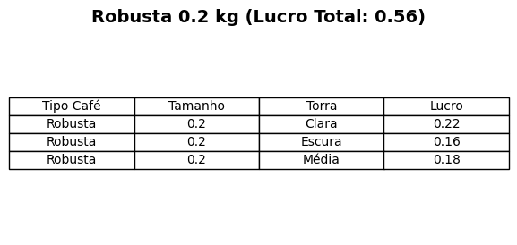
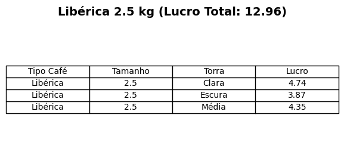
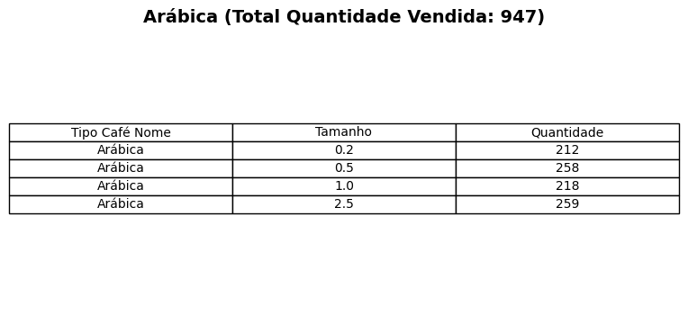
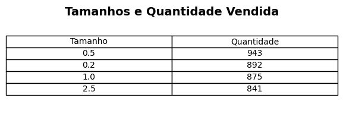
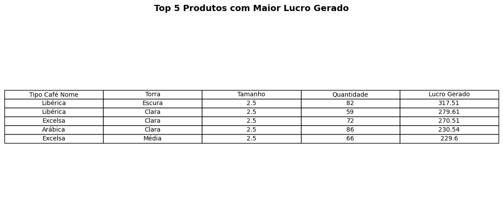

# Painel de Vendas de Café

# Projeto 
## Introdução 
Este arquivo .xlsx tem como objetivo aplicar meus conhecimentos em formatação condicional, tabelas dinâmicas, filtros dinâmicos, fórmulas de pesquisa e gráficos dinâmicos. Após 7 meses, decidi aprimorar o projeto, incluindo uma análise detalhada de indicadores-chave e recomendações de ações estratégicas com base nos resultados obtidos. Esse aprimoramento visa proporcionar uma visão mais aprofundada e acionável dos dados.
## Por que não utilizar apenas o Microsoft Excel?
Embora o Microsoft Excel seja excelente para organização e visualização de dados, ele apresenta limitações para análises mais complexas. Para este conjunto de dados específico, o Excel é adequado e eficiente. No entanto, ferramentas como o Python podem oferecer soluções adicionais para manipulação e análise de dados, especialmente em casos que exigem maior flexibilidade, permitindo a criação de relatórios automatizados e mais intuitivos para extração de insights.

Enquanto o Excel foi essencial para a visualização e análise inicial, o Python complementaria o projeto ao fornecer funcionalidades adicionais que muitas vezes são difíceis de alcançar apenas com o Excel.
## Indicadores Relevantes para Avaliação da Receita
Além dos principais indicadores apresentados no painel (Vendas por País e Top 5 Clientes), selecionei outros indicadores que podem fornecer informações adicionais relevantes sobre a receita gerada:

- Qual tipo de café possui a menor margem de lucro?
- Qual torra gera mais lucro?
- Qual torra possui o maior volume de vendas?
- Qual tamanho possui o maior volume de vendas?
- Qual tamanho gera mais lucro?
- Qual tamanho possui a menor margem de lucro?

### Respostas aos Indicadores

1. **Qual tipo de café possui a menor margem de lucro?**  
   *Arábica Escura 0.2 kg*

2. **Qual torra possui a maior margem de lucro?**  
   *Libérica 2.5 kg*

3. **Qual torra possui o maior volume de vendas?**  
   *Arábica*

4. **Qual tamanho possui o maior volume de vendas?**  
   *0.5 kg*

5. **Qual tamanho gera mais lucro?**  
   *Arábica Clara 2.5 kg*
   

## Autores
Lucas Tavares
- [Linkedin]()

## Referências
 - [Coffee Order Data](https://www.kaggle.com/datasets/effierodriguez/coffee-order-data)

